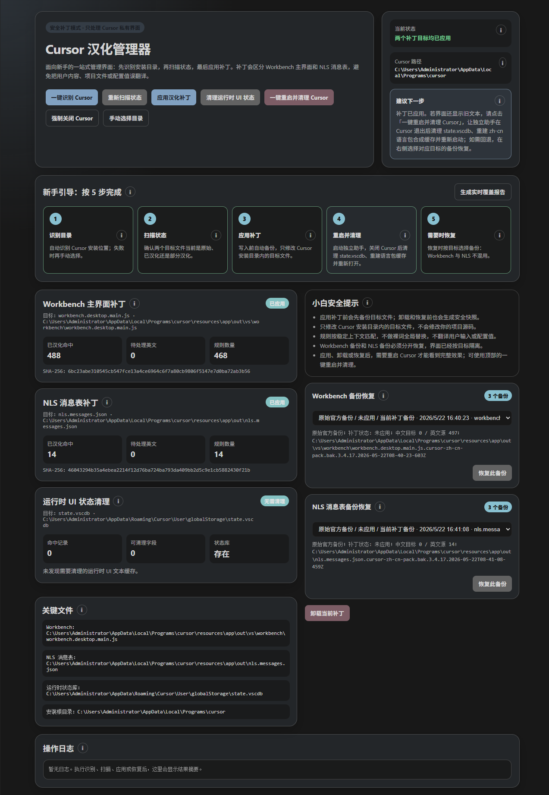

# Cursor 简体中文语言包

面向 Windows 版 Cursor 的**补充**语言包扩展：只处理 Cursor 专用扩展和 Cursor 私有硬编码界面；VS Code 基础翻译请使用官方扩展 `MS-CEINTL.vscode-language-pack-zh-hans`。

当前版本：**1.2.0**（以 `package.json` 为准）。

## 覆盖范围

| 层级 | 目标 | 说明 |
|------|------|------|
| 扩展 NLS | `anysphere.cursor-*` | 通过标准 Language Pack 机制加载 |
| Workbench 硬编码 | `workbench.desktop.main.js` | 主 Cursor 界面（设置、Composer、菜单等） |
| Agents Window | `workbench.glass.main.js` | 智能体窗口界面及其内置 Settings（与主设置同源） |
| NLS 消息表 | `nls.messages.json` | 少量未进入扩展包、但写入全局消息表的私有文案 |

**不会**生成或打包 `translations/main.i18n.json`，也不会复制 `vscode.*`、`ms-vscode.*` 等官方内置扩展翻译。

标准 Language Pack 资源**不会**修改 Cursor 安装目录。只有在命令面板打开 **Cursor 汉化管理器** 并点击 **应用汉化补丁** 时，才会写入上述 Workbench / NLS 目标文件；写入前会自动备份，并支持从管理器恢复。

建议 Cursor 版本 **≥ 3.4.17**（已在 3.8.x 上验证 Agents Window 双 bundle 补丁）。

## 基础中文语言包

请先安装官方 VS Code 简体中文语言包：

```powershell
cursor --install-extension MS-CEINTL.vscode-language-pack-zh-hans
```

本扩展只作为 Cursor 专用补充层，不会覆盖官方完整翻译。

## 安装和启用

```powershell
cursor --install-extension MS-CEINTL.vscode-language-pack-zh-hans
cursor --install-extension .\cursor-zh-cn-pack-1.2.0.vsix
```

安装后在 Cursor 中：

1. 打开命令面板，运行 `Configure Display Language`
2. 选择 `zh-cn` / `简体中文`
3. 重启 Cursor
4. 打开 **Cursor 汉化管理器**，识别安装目录并 **应用汉化补丁**
5. 使用 **一键重启并清理 Cursor**，然后重新打开 **智能体窗口**（若使用 Agents Window）

## Cursor 汉化管理器

命令面板运行 `Cursor 汉化管理器`，提供一站式流程：

- 自动 / 手动识别 Cursor 安装目录
- 扫描 Workbench（desktop + glass）、NLS 消息表、运行时 UI 缓存状态
- **应用汉化补丁**（Workbench + NLS 一并处理）
- **卸载补丁**、分别恢复 Workbench / NLS 备份
- **清理运行时 UI 状态**（`state.vscdb` 中英文界面缓存）
- **一键重启并清理 Cursor**（独立助手：关闭进程 → 清理缓存 → 重启）
- 操作日志与备份列表

### 补丁目标（一次应用，多文件写入）

| 文件 | 路径（相对 `resources/app`） |
|------|------------------------------|
| 主 Workbench | `out/vs/workbench/workbench.desktop.main.js` |
| Agents Window | `out/vs/workbench/workbench.glass.main.js`（存在则自动补丁） |
| NLS 消息表 | `out/nls.messages.json`（依赖 `out/nls.keys.json` 索引） |

若安装目录中不存在 `workbench.glass.main.js`（较旧版本），扩展会跳过 glass，仅处理 desktop。

### 目录校验

有效 Cursor 根目录需包含：

- `resources/app/package.json`
- `resources/app/out/nls.keys.json`
- `resources/app/out/nls.messages.json`
- `resources/app/out/vs/workbench/workbench.desktop.main.js`

自动识别顺序：已保存配置 → 运行中的 `Cursor.exe` → `PATH` → 注册表 → 常见安装路径。

### 推荐流程（5 步）

1. **识别目录** — 一键识别或手动选择
2. **重新扫描状态** — 只读，不写入
3. **应用汉化补丁** — 写入并备份
4. **一键重启并清理 Cursor** — 刷新已加载界面与 UI 缓存
5. **恢复备份**（可选）— Workbench 与 NLS 备份分开恢复

## 补丁说明

补丁针对 Cursor 私有界面中**未走标准 NLS** 的硬编码文案，例如设置页（General、Models、Indexing、Network、Beta 等）、Composer / Agent 菜单、Agents Window 菜单栏与侧栏、完整性提示改写等。

当前规则规模（随版本迭代）：

- Workbench 补丁规则：约 **900** 条（`data/workbench-patches.json`）
- NLS 消息表规则：约 **17** 条（`data/nls-message-patches.json`）
- 运行时安全策略：`data/workbench-patch-runtime-policy.json`（安全前缀、命中上限、受保护关键字）

### 策略要点

- 修改前计算目标文件 SHA-256；首次应用在同目录生成带版本与时间戳的备份
- desktop 与 glass **各自独立备份**（前缀分别为 `workbench.desktop.main.js.cursor-zh-cn-pack.*` 与 `workbench.glass.main.js.cursor-zh-cn-pack.*`）
- 规则按**模块上下文前缀**匹配（如 `label:`、`settings.*` 块），不做裸词全局替换
- 加载时校验每条规则 `source` / `target` **括号结构一致**，避免破坏 bundle 语法
- 应用前校验命中数、变更行数与受保护运行时关键字
- 汉化后会触发 Cursor 完整性校验；扩展会替换相关提示文案，并在可能时抑制误导性的 “installation corrupt” 弹窗

Cursor 升级后 bundle 可能被覆盖或压缩符号变化，需重新扫描并应用补丁。若状态为 **未知** 或 **部分应用**，先确认版本与路径，勿盲目重复写入。

## 维护者：生成与扫描

默认扫描目录为 `D:\cursor`，可通过环境变量 `CURSOR_ROOT` 或命令行参数覆盖。

### 提取 Cursor 专用扩展翻译

```powershell
npm run extract
# 或
node .\scripts\extract-cursor-nls.mjs D:\cursor
```

产物：

- `translations/extensions/anysphere.cursor-*.i18n.json`
- `reports/untranslated-extensions.json`

运行时会清理旧的 `translations/main.i18n.json` 及非 Cursor 专用扩展翻译，避免与官方语言包冲突。

### 扫描 Workbench 未汉化硬编码

```powershell
npm run scan:workbench
# 或
node .\scripts\scan-workbench-untranslated.mjs D:\cursor
```

产物：

- `reports/workbench-untranslated.json`
- `reports/workbench-untranslated.md`

### 提取可写入补丁表的 source 候选

```powershell
npm run scan:patch-sources
# 或
node .\scripts\extract-workbench-patch-sources.mjs D:\cursor
```

产物：

- `reports/workbench-patch-source-candidates.json` / `.md`
- `data/workbench-patches.staging.json`

相关配置：

| 文件 | 用途 |
|------|------|
| `data/workbench-untranslated-scan-config.json` | 扫描范围与过滤 |
| `data/workbench-hardcoded-needles.json` | 重点观察词 |
| `data/workbench-patches.json` | 正式补丁替换表 |
| `data/workbench-patch-runtime-policy.json` | 运行时安全策略 |
| `data/nls-message-patches.json` | NLS 消息表补丁 |
| `data/nls-exact-translations.json` | 提取脚本用的精确翻译表 |

## 开发与打包

```powershell
npm install
npm run compile
npm run package
npm run release:build
```

| 命令 | 说明 |
|------|------|
| `npm run compile` | 编译 TypeScript 扩展 |
| `npm run package` | 生成当前版本 `.vsix` |
| `npm run release:build` | 在 `artifacts/release/` 生成 GitHub Release 资产 |
| `npm run build` | 同步版本 + 提取扩展翻译 + 编译 |

打包前自动执行 `version:sync`（版本以 `package.json` 为准）。推到 `main` / `master` 时，若提交信息符合发布格式，工作流会自动创建或更新 GitHub Release。

提交信息示例：

```text
v1.2.0
- 支持 Agents Window（workbench.glass.main.js）双 bundle 补丁
- 补充设置页与 NLS 消息表汉化规则
```

## 配置项

| 键 | 说明 | 默认 |
|----|------|------|
| `cursorZhCn.cursorRoot` | Cursor 安装根目录，如 `D:\cursor` | 空（由管理器识别） |
| `cursorZhCn.enableWorkbenchPatch` | 是否允许管理器修改 Workbench bundle | `true` |

## 已知限制

- 不复制官方 VS Code 中文包，也不接管完整主界面翻译
- 远程 Web 内容、API 动态返回、未纳入规则的低置信度硬编码仍可能显示英文
- desktop 与 glass 压缩符号不同，部分 UI 需分别维护规则（如菜单栏 `ka` / `B` 与 desktop 的 `Vl` / `P`）
- 补丁依赖当前 Cursor 版本的 bundle 结构，大版本升级后可能需要更新规则
- 修改安装目录文件可能触发 Cursor 完整性提示；按管理器流程应用补丁即可，一般可忽略或选择「不再显示」

## 汉化管理器界面展示


